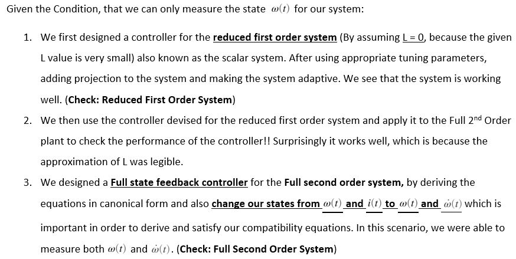

# 
Adaptive-Controls-Project-Part-1

**
 To design a [model reference adaptive controller](http://www.phoneoximeter.org/uploads/media/EECE574-11_MRAC_01.pdf) for a DC motor drive, which accounts for the presence of an unknown deadzone in the power electronincs, so that the approximate velocity tracking may be achieved without knowledge of motor, load or deadzone parameters.
**

### Background:

 

 #### Dynamics of the **brush-commutated permanent-magent DC motor** turning an inertial load are described by:

 

### Overview (For Part 1):

 

#### Tasks List:
**Steps taken to develop a MRAC controller**
- Finding the reduced the equations (Reduced 1st order or 2nd order equations [**In canonical form**]) and replace coefficents with constant star elements.
- Specify the Desired trajectory and find it's derivative.
- Write the equation of reference trajectory & its derivative with reference controller element (r).
- Writing the Reference Error dynamics (er) equation and it's derivative, and equate the derivative of er to eventually find the reference controller element (r).
- Chose the controller with it's star coefficients (theta_x and theta_r)star elements.
- Write Error Dynamics (e) equation and it's derivative, equate the derivative of e along with closing it's loop with our controller u to eventually find the derivative of e in terms of e, r and star values.
- Find an appropriate Lyapunov Function and it's derivative.
- Making use of the condition that for **stability** the derivative of the Lyapunov Function needs to be **strictly negative** which will make our Lyapunov Function monotonically decreasing, we equate some terms of that derivative of Lyapunov to help us compute the derivative of adaptive theta_x and theta_r values.

Note: In the above steps if we replace our controller's star coefficients with adaptive coefficients then we have devised MRAC system.

#### Objectives Achieved: 

- Constructed an excitation signal for System Identification following the saturation limit for DAC (Digital-to-Analog Converter)
- Estimated the SNR (Signal to Noise Ratio) for each path of signal `u1 -> y1` and `u1 -> y2`
- Computed the Power Spectrum for responses and noise signals
- Applied H1 estimate technique to estimate the frequency response function and estimated coherence of each path
- Estimated Discrete time transfer functions for each path using `invfreqz()` function and converted it into minimum realization using `minreal()` function
- Generated a Balanced Realization using `balreal()` and plotted the [Hankel singular values](https://en.wikipedia.org/wiki/Hankel_singular_value) to help generate a reduced order LTI discrete time state space model using `modred()`
- Generated z-domain grid to plot the z-domain eigen values (poles) for each path using `zgrid()` function
- Computed and Plotted final discrete-time state space LTI object in comparison to H1 estimate

 

 

 

#### Languages Used:
- Matlab
- Simulink

#### Use of each file:
- [**Midterm_Project_Japnit_Sethi.mlx**](Midterm_Project_Japnit_Sethi.mlx) - Executable file with learly defined problem statement and approach
- [**Midterm_Project_Japnit_Sethi.pdf**](Midterm_Project_Japnit_Sethi.pdf) - Published Document for a quick check of Solutions and Code
- [**s20_plant.p**](s20_plant.p) - Plant function file that takes excitation u as input (1xN) and returns the output response y(2xN), where N is the number of samples

