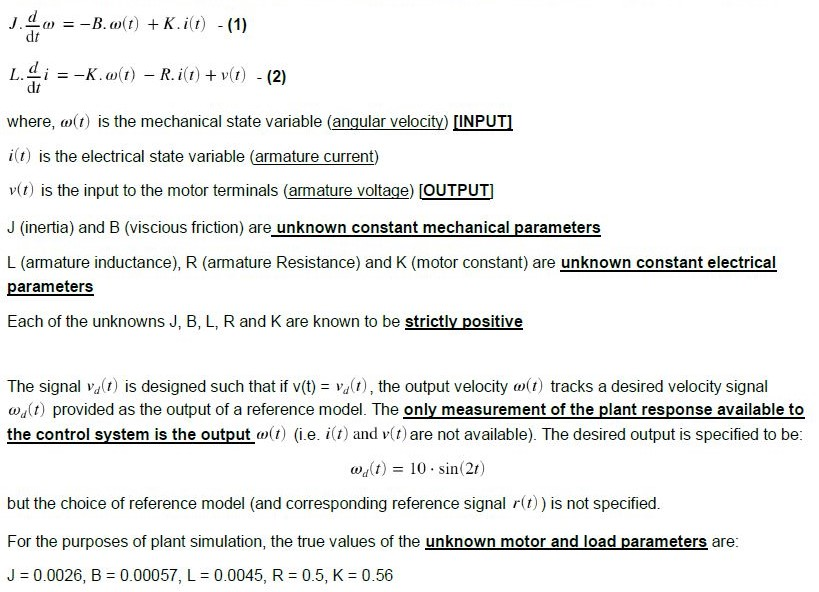

# 
Adaptive-Controls-Project-Part-1

**
 To design a [model reference adaptive controller](http://www.phoneoximeter.org/uploads/media/EECE574-11_MRAC_01.pdf) for a DC motor drive, which accounts for the presence of an unknown deadzone in the power electronincs, so that the approximate velocity tracking may be achieved without knowledge of motor, load or deadzone parameters.
**

### Background:

 

 #### Dynamics of the **brush-commutated permanent-magent DC motor** turning an inertial load are described by:

 

#### Overview (For Part 1):

#### Tasks List:
- [x] Executing the appropriate code based on the sequential objectives below
- [x] Debugging (Comparison of [H1 Estimate](https://community.sw.siemens.com/s/article/what-is-a-frequency-response-function-frf) and [Minimum Realization](https://en.wikipedia.org/wiki/Minimal_realization) FRF)
- [x] Finding the appropriate reduced order LTI object whose FRF is in coherence with the above two

#### Objectives Achieved: 

- Constructed an excitation signal for System Identification following the saturation limit for DAC (Digital-to-Analog Converter)
- Estimated the SNR (Signal to Noise Ratio) for each path of signal `u1 -> y1` and `u1 -> y2`
- Computed the Power Spectrum for responses and noise signals
- Applied H1 estimate technique to estimate the frequency response function and estimated coherence of each path
- Estimated Discrete time transfer functions for each path using `invfreqz()` function and converted it into minimum realization using `minreal()` function
- Generated a Balanced Realization using `balreal()` and plotted the [Hankel singular values](https://en.wikipedia.org/wiki/Hankel_singular_value) to help generate a reduced order LTI discrete time state space model using `modred()`
- Generated z-domain grid to plot the z-domain eigen values (poles) for each path using `zgrid()` function
- Computed and Plotted final discrete-time state space LTI object in comparison to H1 estimate

 

 

 

#### Languages Used:
- Matlab
- Simulink

#### Use of each file:
- [**Midterm_Project_Japnit_Sethi.mlx**](Midterm_Project_Japnit_Sethi.mlx) - Executable file with learly defined problem statement and approach
- [**Midterm_Project_Japnit_Sethi.pdf**](Midterm_Project_Japnit_Sethi.pdf) - Published Document for a quick check of Solutions and Code
- [**s20_plant.p**](s20_plant.p) - Plant function file that takes excitation u as input (1xN) and returns the output response y(2xN), where N is the number of samples

Steps taken to develop a MRAC controller for my Reduced 1st Order System:
- Finding the reduced 1st Order equation and replacing coefficents with constant star elements
-
- Specifying the Desired trajectory and finding it's derivative
- Writing the equation of reference trajectry with reference controller element (r)
- Writing the Reference Error dynamics (er) equation and it's derivative, and equating it to eventually find the reference controller element (r)
- Writing Error Dynamics Equation for later use in simulink blocks (e)
- Finding the controller with star elements
- Closing the loop to use the controller and thus finding the controller's star coefficients (theta_x and theta_r)
Note: THe above steps are all used to make it MRC, we can further make some changes as below to make it MRAC
- We can further make it adaptive by replace the star coefficients with adaptive elements a(t) and b(t)
- Find an appropriate Lyapunov Function and it's derivative
